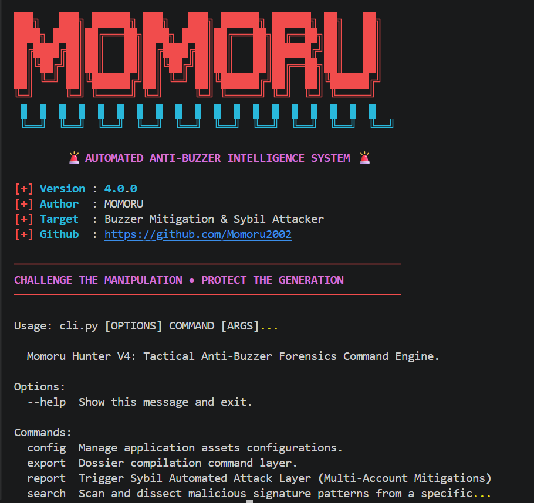

# 🚨 Momoru Hunter V4

<p align="center">
  
</p>

<p align="center">
  <strong>Automated Anti-Buzzer Intelligence System</strong><br>
  Detect • Analyze • Understand
</p>

<p align="center">
  A modular command-line intelligence framework for analyzing publicly accessible online conversations and identifying potential coordinated messaging patterns.
</p>

---

## ✨ Features

* ⚡ Rich CLI interface with cyberpunk theme
* 🔌 Plugin-based architecture
* 📊 Similarity analysis engine
* 📈 Statistical summaries
* 📁 Export reports to JSON, CSV, and HTML
* ⚙️ YAML configuration support
* 🧪 Automated testing with Pytest
* 🔄 GitHub Actions CI integration
* 🛠 Modular command structure
* 📋 Extensible plugins and exporters

---

## 📸 Preview

Momoru Hunter V4 CLI:


---

## 📂 Project Structure

```text
momoru/
├── commands/
├── core/
├── exporters/
├── plugins/
├── themes/
├── tests/
├── docs/
├── config.yaml
├── .env
└── main.py
```

---

## 🚀 Installation

Clone the repository:

```bash
git clone https://github.com/yourusername/Momoru-Hunter-V4.git
cd Momoru-Hunter-V4
```

Create a virtual environment:

```bash
python -m venv .venv
```

Activate it:

### Windows

```bash
.venv\Scripts\activate
```

### Linux / macOS

```bash
source .venv/bin/activate
```

Install dependencies:

```bash
pip install -r requirements.txt
pip install -e .
```

---

## 🔑 API Credentials

Momoru Hunter V4 includes a `.env` file as an **example template only**.

Any credentials included in the repository are placeholders intended to demonstrate the required configuration format.

Before using the project, you should create your own accounts and replace the example values with your own credentials.

Example:

```env
API_KEY=your_api_key
API_SECRET=your_api_secret
USERNAME=your_username
PASSWORD=your_password
```

> ⚠️ Never upload your real credentials to GitHub.

---

## 🌐 Proxy Configuration

Some workflows may optionally support proxy usage depending on your environment.

Momoru Hunter V4 **does not provide proxy servers**.

If you require a proxy, you are responsible for using your own infrastructure, such as:

* Purchasing a proxy service from a trusted provider.
* Using a proxy server hosted on your own VPS.
* Using proxy infrastructure managed by your organization.

Example proxy format:

```env
PROXY=http://username_proxy:password_proxy@ip_proxy:port_proxy
```

Example:

```env
API_KEY=your_api_key
API_SECRET=your_api_secret

PROXY=http://username_proxy:password_proxy@ip_proxy:port_proxy
```

> ⚠️ The proxy values above are examples only.

If you do not use a proxy, leave the field empty or disable proxy support in the configuration.

---

## ⚙️ Configuration

Several configuration files contain demonstration values.

You are expected to customize them according to your own analysis requirements.

### Target Accounts

Replace example targets:

```yaml
targets:
  - example_account_1
  - example_account_2
```

with your own public targets.

---

### Keywords / Narrative Examples

Some modules include sample text snippets and descriptions used for similarity analysis.

Example:

```yaml
keywords:
  - "example narrative"
  - "promotional message"
  - "coordinated wording"
```

Replace them with the phrases, narratives, descriptions, or publicly accessible messages relevant to your own research.

Example:

```yaml
keywords:
  - "Support candidate X"
  - "Join our movement"
  - "This policy harms society"
```

The quality of the analysis depends heavily on the relevance of the keywords you provide.

---

## 💻 Usage

Show help:

```bash
momoru --help
```

Search target:

```bash
momoru search <target>
```

Generate report:

```bash
momoru report results.json
```

Export report:

```bash
momoru export --format html
```

Display statistics:

```bash
momoru stats
```

Show configuration:

```bash
momoru config show
```

---

## 🔄 Typical Workflow

```text
Configure Credentials & Proxy
            ↓
Configure Targets & Keywords
            ↓
Collect Public Information
            ↓
Analyze Similarity
            ↓
Generate Statistics
            ↓
Export Reports
            ↓
Review Findings
```

---

## 🧪 Testing

Run all tests:

```bash
pytest
```

Coverage:

```bash
pytest --cov
```

---

## 🤝 Contributing

Contributions are welcome.

Please read `CONTRIBUTING.md` before opening an issue or submitting a pull request.

---

## ⚖ Ethical Use

Momoru Hunter V4 is intended for:

* Academic research
* Digital literacy studies
* OSINT investigations
* Analysis of publicly accessible information

Users are responsible for complying with applicable laws, service agreements, platform policies, and ethical standards.

This project is **not intended** for:

* Unauthorized access to systems or accounts
* Circumventing authentication mechanisms
* Collecting private information without authorization
* Activities that violate applicable laws or platform policies

---

## 📜 License

This project is licensed under the MIT License.

See the `LICENSE` file for more information.

---

## 👨‍💻 Author

Developed by **MOMORU**

> *"Challenge the manipulation • Protect the generation."*
